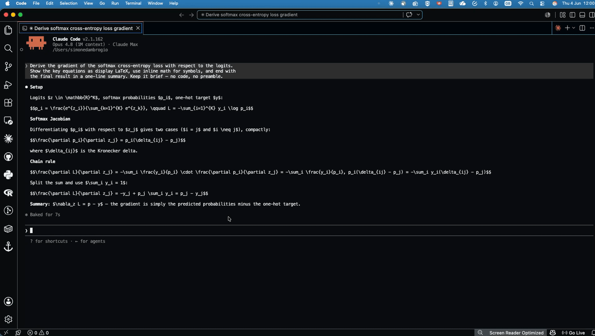

<h1 align="center">Claude Code Preview</h1>

  Render <a href="https://docs.claude.com/claude-code">Claude Code</a> responses with LaTeX math, code highlighting, and markdown formatting — straight from VS Code's integrated terminal.

  

Claude Code answers in markdown, but the terminal shows it as plain text: `$$\nabla_\theta J(\theta)$$` stays raw LaTeX, code blocks lose their highlighting, and copying a formula means untangling line-wrapped source. This extension turns the latest response into a live markdown preview — one keystroke, no setup.

## Quick start

1. Open a terminal in VS Code and run `claude`.
2. Send a message.
3. Press `Cmd+K V` with the terminal focused.

That's it. The preview opens beside the terminal and auto-refreshes after every new response.

## Keybindings

| macOS | Windows / Linux | Command |
| --- | --- | --- |
| `Cmd+K V` | `Ctrl+K V` | **Open Latest Response to the Side** |
| `Cmd+Shift+V` | `Ctrl+Shift+V` | **Open Latest Response** (current pane) |
| `Cmd+←` | `Ctrl+←` | **Show Older Response** (when the preview is focused) |
| `Cmd+→` | `Ctrl+→` | **Show Newer Response** (when the preview is focused) |

The open shortcuts are active when a terminal is focused, mirroring VS Code's built-in markdown preview keys; the navigation shortcuts only when the response preview is the focused tab. All commands are also available from the Command Palette.

## Features

- **No setup.** Install the extension and it just works alongside Claude Code. No shell hooks, no config files to edit.
- **Math rendering.** Inline `$...$` and display `$$...$$` LaTeX expressions render via VS Code's built-in KaTeX support.
- **Auto-refresh.** The preview updates itself after every new response — open it once and keep chatting.
- **Per-session previews.** The extension finds *which* session belongs to the focused terminal by walking its process tree. Parallel sessions in the same project show their own previews — no collisions.
- **Response history.** Step back through every response of the session with `Cmd+←` / `Cmd+→` while the preview is focused — like `/copy N`, but visual. A new response snaps the preview back to the latest.
- **Readable tab titles.** Previews are named after the session (its summary, or the first prompt) instead of a UUID.
- **Easy copying.** Select rendered text from the preview instead of fighting line-wrapped terminal output.

## Requirements

- [Claude Code](https://docs.claude.com/claude-code) installed and used in a terminal (any terminal — VS Code's integrated terminal works best).
- macOS or Linux for precise per-session resolution. Windows users get the most-recently-updated session as a fallback.

## How it works

The extension watches Claude Code's transcript files at `~/.claude/projects/**/*.jsonl`. When a transcript changes, it extracts the latest assistant response and writes it to the extension's private storage. The preview command resolves which session belongs to your focused terminal (via process-tree walking and Claude Code's `~/.claude/sessions/<pid>.json` registry) and opens the corresponding markdown file.

If precise resolution fails (e.g. on Windows or when `pgrep` is unavailable), the command falls back to the most-recently-updated session.

## Troubleshooting

Logs are written to the **Claude Code Preview** output channel: `View → Output → Claude Code Preview`. If the preview doesn't open:

- Confirm `~/.claude/projects/` exists and contains `.jsonl` transcript files.
- Check that the terminal you focus is running `claude` (not a parent shell or `tmux` wrapper).
- Reload the window after install: `Cmd+Shift+P → Developer: Reload Window`.

## License

[MIT](LICENSE)
